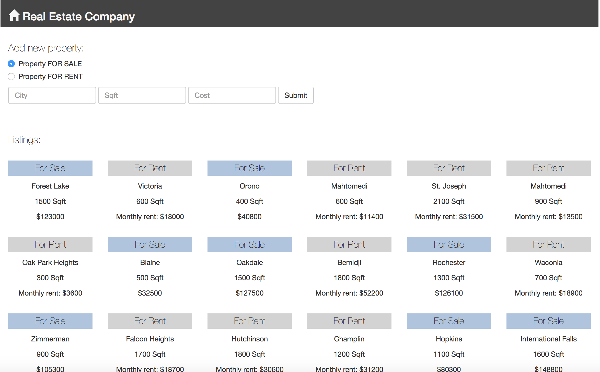

# weekend-challenge4 - Real Estate Challenge (jQuery, Node, MongoDB and Bootstrap)

## Requirements
Welcome to weekend challenge 4! This weekend, you will take on the role of an application developer for a real estate company. You will be working with Data that we will be providing to you. It will be a collection called “listings”. Inside of it, you will find information for properties that are either for Rent or for Sale.
You job, is to get this Data on the DOM, accounting for the inconsistent datatypes that are possible with MongoDB. But additionally, let’s bring in Bootstrap to the mix to make sure that the application looks as good as possible.

**Base Mode**
Here are the requirements of the project:

- Create a Full Stack application from the ground up using jQuery, Node, and MongoDB,

- Work with the data set that we provide for you,

- Use Bootstrap to present the data,

- Account for the different data (“rent” versus “cost) and ensure that this is noted on the display of the information, by listing “For Rent” or “For Sale” based on which of the two properties that it has.

To work with the provided data:

- Download the provided file,

- Run this command in your Terminal: `mongoimport --db realestate --collection listings --file listingData.js`

- Note that you will need to run this from the folder which you download the ‘listingData.js’ to.

**Hard Mode**
Create an interface for adding additional properties to the collection. You will need to give the user an option for either a Rent property or a Sale property. Check out this Stack Overflow for information on how to accomplish this: http://stackoverflow.com/questions/14453864/use-more-than-one-schema-per-collection-on-mongodb

**Pro Mode**
Host the application on Heroku and mLabs. You will need to transfer the data up to mLabs. In will need to research to accomplish this.

## Setup
1. Clone the repo to your computer using `git clone https://github.com/claudiacalderas/weekend-challenge4.git`
2. Run `npm install`
4. Ensure Mongo is running `mongod`
5. If running the app locally, make sure mongoURI is pointing to the localhost database : `var mongoURI = 'mongodb://localhost:27017/realestate';` mongoURI is defined in /server/app.js

## Screenshot

